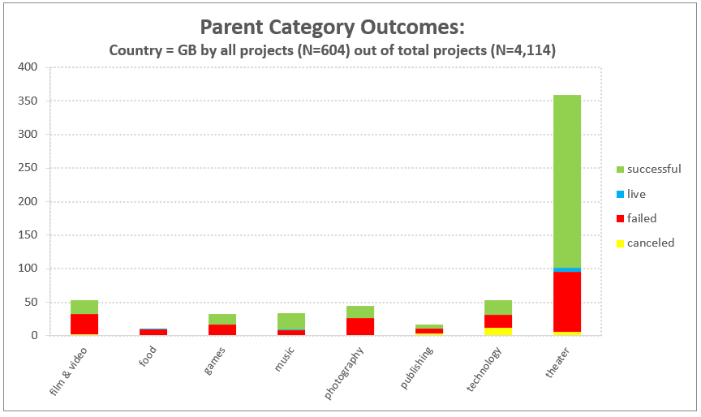
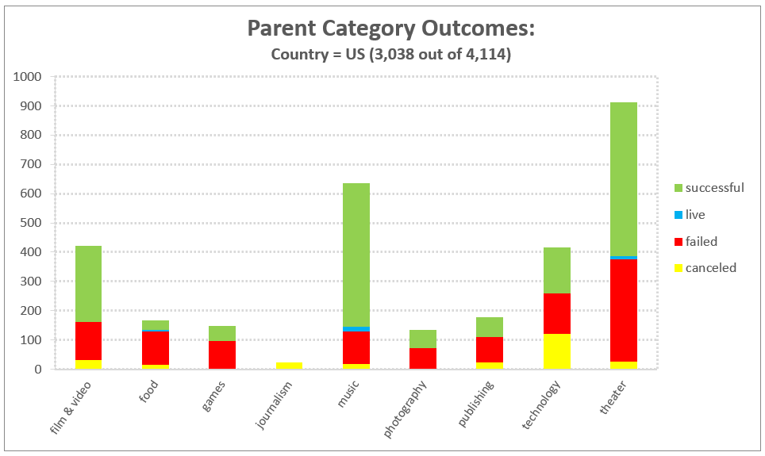
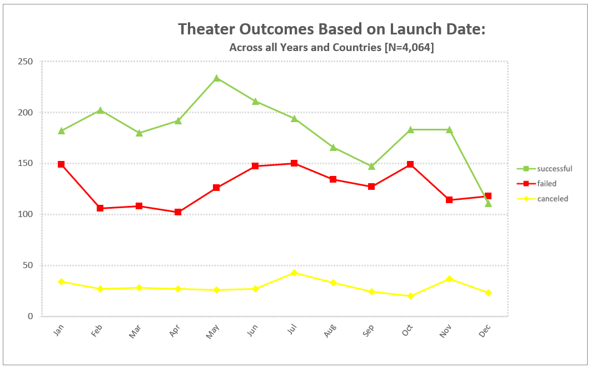
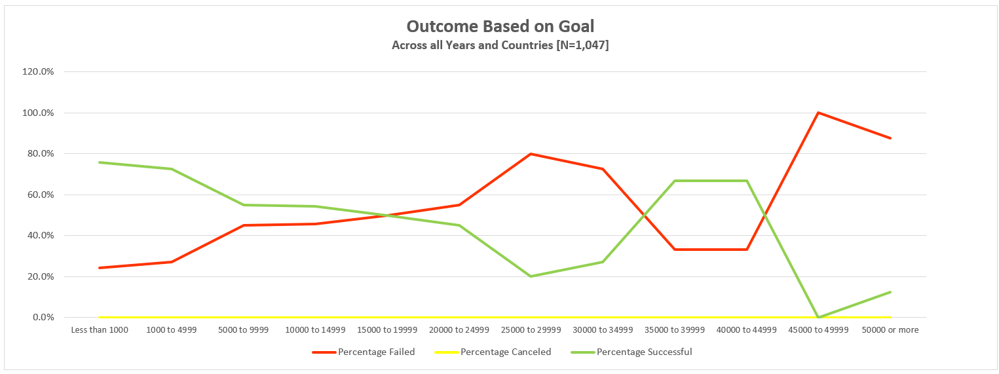

# Analysis of Kickstarter Campaigns

## Overview of Project: Kickstarter Analysis for Louise's Play *"FEVER!!"*
[https://docs.google.com/presentation/d/e/2PACX-1vRUrb1EvORgiedw3s0WnSgOEZvOx2VrT7ftX-hra8_gf0nCqZStqGvTSbhJso24RiskEaeuJw6Y2_OG/pub?start=true&loop=false&delayms=3000](https://docs.google.com/presentation/d/e/2PACX-1vRUrb1EvORgiedw3s0WnSgOEZvOx2VrT7ftX-hra8_gf0nCqZStqGvTSbhJso24RiskEaeuJw6Y2_OG/pub?start=true&loop=false&delayms=3000)

### Purpose and Background
Louise, a very good friend and a brilliant writer, recently attempted to raise funds to produce a play she wrote (*"Fever!!"*).  Her attempt was, however, unsuccessful. Knowing the person she is and the mottos she aspires to (*Try, Try Again* and *Never Give Up*), she wanted to gain a more thorough perspective in how to approach another attempt with a successful outcome. She was able to obtain a dataset of other Kickstarter projects from around the world for a variety of fundable projects. In some previous analysis attempts I conducted for her, she has seen a more directed approach to center this analysis attempt. There are two decision points that she believes will provide guidelines on how to better organize her fundraising activities. They are: (a) how different campaigns fared in relation to their launch dates and (b) compare whether they attained their funding goals. 

Using the Kickstarter dataset that Louise provided, we will be able to see whether the fundraising category outcomes are related to their launch dates. Also, she may be able to see a relationship between the funding outcome and the amount of the funding goals. The outcomes are below:

•	Successful (met or exceeded funding goal), 

•	Live (project has not completed yet), 

•	Failed (did not meet the funding goal),  and

•	Canceled (due to reasons unforeseen, the fundraising attempt was halted).

Ultimately, Louise wants to know how different campaigns fared in relation to their kickstart funding launch dates and their funding goals.

## Analysis and Challenges

***Overview of Analyses***
Looking at the data Louise obtained, there were many opportunities to observe the above factors and their impact on the success (or not) of the pertinent Kickstarter. There are logically two characteristics of the Kickstarter Programs that had to be addressed so the data could be trusted. One thing to focus on is the fact this data was obtained all over the world. After an initial look at the data, the overall ratios of successful campaigns were basically the same, no matter the country. By example, here are two graphs showing the US and Great Britain’s data for the success rates on the Parent Categories of Kickstarters.

We have found that while there are only a total of 604 Kickstarter campaigns for plays in Great Britain, the "theater" category was the most successful (see above chart).

In comparison against the US data, visually it appears the US had a similar successful campaign for the master Parent Category of "Theater" (see above chart).

Another factor that could impact the success rate of the project was how the kickstarters were conducted from country to country. This was controlled by analyzing the date that the kickstarters were launched.

The month that launched the most successful Kickstarter campaigns was May as seen in the above chart. However, January, June, July and  October all had roughly the same number of failed campaigns launched. This can be determined by examining the points along the trend lines of the chart. 

Just by glancing at the data, we can determine that theater is a popular and successful type of campaign overall. By using filters, we can see that theater follows the overall trend: there is a spike of successful campaigns that began in June, but that tapers off by the end of the year. By comparison, the data around technology campaigns reveals a different story. Instead of one large spike, their trend lines are a bit all over the place and less predictable.

***Challenges to Overcome***

As mentioned before, the analyses had to be built on assumptions, mainly, did each employ the same tactics during the kickstarter campaign. This information was not available.

## Results
Two conclusions are made about the Theater Outcomes by Launch Date:

1. The month that launched the most successful Kickstarter campaigns was May as seen in the above chart. However, January, June, July and  October all had roughly the same number of failed campaigns launched. 
2. December shows a decline in successful kickstarter for Theater category while Failed campaigns were slightly larger. There was also a decline in the number of canceled campaigns. The assumption here is that people perhaps were thinking more towards the impending holidays rather than supporting a kickstarter.

For the experience on whether funding goals were met based on the overall projected funded amount, the most successful campaign was seen in projected funding less than $1,000. The most unsuccessful amount was seen in the projected funded amount of $45,000 up to and including $49,999 (see below).

There is a summary of the limitations of the dataset, and there is a recommendation for additional tables or graphs (2 pt).

SUMMARY OF LIMITATIONS: The dataset included many countries and their success and failed outcomes. If Louise wanted more clear data, I would recommend putting all efforts into a local campaign in the location where she plans to put on her play.

Also, I would recommend completing more research around the months for failed campaigns in order to see what was happening in those countries at the time of year that would have kept the population keeping their money close to their chest! Include the findings on the chart already provided showing the months breakdown.

